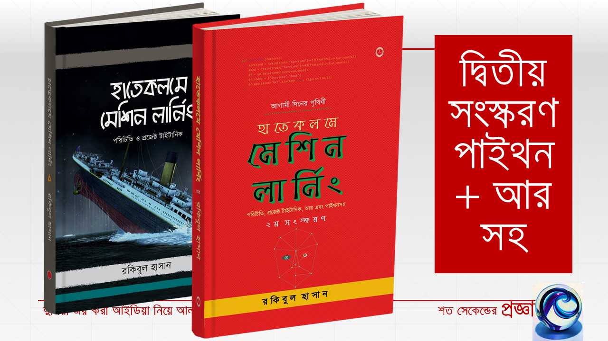

# মেশিন লার্নিং

## পাইথন আর সাইকিট লার্ন

> It’s none of their business that you have to learn to write. Let them think you were born that way.
>
> --  Ernest Hemingway

লিখছি প্রতিদিন। অনেকটাই শেষ হয়ে আসছে প্রায়। ২০১৯ সালের বইমেলায় আসবে দ্বিতীয় ভাগে। বইয়ের ভুলগুলো অনুগ্রহ করে জানাবেন [http://m.me/raqueeb](http://m.me/raqueeb) ফেসবুক মেসেঞ্জারে। 

আগের বই

### হাতেকলমে মেশিন লার্নিং

**পরিচিতি ও প্রজেক্ট টাইটানিক**

[অনলাইন](https://raqueeb.gitbooks.io/mlbook-titanic/) এবং [রকমারি](https://rokomari.com/book/174186)


এবং 

### হাতেকলমে ডীপ লার্নিং

**হাতের লেখা চিনতে প্রজেক্ট**

[অনলাইন](https://raqueeb.gitbooks.io/deep-learning/)

### দর্শন এবং বই লেখার পেছনের ডাটা

এই বই লিখতে নিচের ডাটাগুলোকে বিবেচনায় নেয়া হয়েছে। 


১. সবাইকে একটা বই কোন রকমে ৫৫ পাতা পর্যন্ত পড়াতে পারলে আমার কাজ হাসিল। জানা কথা, যারা অনেকদূর যাবেন তারা আরো বেশি পড়বেন। 

২. বইয়ের দাম ১৫০ টাকা হলে কিনতে আগ্রহী হতে পারেন বেশিরভাগ পাঠক। মানে, বেল কার্ভ ১৫০ +/- ২৫। ডিসকাউন্ট সহ। কাট-অফ লাইন ১৭৫ টাকা। এর বেশি হলে 'মোবিডিক' লিখতে হবে। 

৩. একটা বই থেকে পাঠক মাত্র ২টা দর্শন মানে পেছনের ফিলোসফি নিতে পারলে সেটার দাম উঠে যায়। মাত্র দুটো দর্শন। আমাদের থাকবে পাঁচ। আমি প্রচুর 'হিন্টস' দেবো এর মাঝে।  

৪. বইটা ধার দেবার মতো করে তৈরি করতে হবে। হার্ড কাভার নয়। পেপারব্যাক। খাতার মতো হলে আরো ভালো হতো। কাভার ডিজাইন ক্রাউডসোর্স মডেলে চাইছি। 

৫. এক বসাতে ২০-৩০ পৃষ্ঠা পড়ে পৃথিবীর মানুষ। আমাদের দেশে সেটা অনেক অনেক কম। ছবি আর প্রচুর পয়েন্টার দিতে হবে পাতায় পাতায়। চেষ্টা থাকবে এক বসাতে ৫ পাতা।

৬. আমার ২৮ বছরের কোর-স্কিল হচ্ছে "প্রজেক্ট ডেলিভারি"। রেইন অর শাইন। সেনাবাহিনী শিখিয়েছে আমাকে। অনেকটা সময় ধরে। প্রজেক্ট হিসেবেই শুরু করেছি বইগুলো।

....


