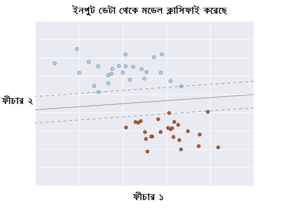

# সুপারভাইজড লার্নিং

> Suppose you are providing solution to your kids for each and every situation in their life, it is called your kids are supervised. But, if your kids take their decisions out of their own understanding, it is called your kids are unsupervised.
>
> --- Answer from Quora

একদম ফান্ডামেন্টাল লেভেলে মেশিন লার্নিং কয়েক ধরণের। আমাদের বেশি কাজে লাগে 'সুপারভাইজ্ড লার্নিং'। বাকী থাকে 'আন-সুপারভাইজ্ড লার্নিং' আর একটা দুটো ভাগ। আমার কাজ হচ্ছে 'সুপারভাইজ্ড লার্নিং' নিয়ে গল্প দেয়া। এটা বুঝলে পুরো পৃথিবী সহজ। 'সুপারভাইজ্ড লার্নিং' হচ্ছে মানুষের মতো করে শেখা। মা বাবা যেভাবে আমাদের বড় করেন গাইডেন্স/সুপারভিশন দিয়ে।

মানুষের শেখে অভিজ্ঞতা থেকে। মেশিনেরও একই অবস্থা। মেশিনের কাছে অভিজ্ঞতা হচ্ছে ডেটা। ডেটা হচ্ছে আমাদের কাছে এখন যা আছে। 'সুপারভাইজড লার্নিং' বলতে মেশিনের জন্য এমন একটা মডেল তৈরি করতে হবে যা আমাদের কাছে রাখা বিভিন্ন ডেটার ভেতরের সম্পর্ক বোঝার চেষ্টা করে। আমাদের কাছে রাখা ডেটাগুলোর বিভিন্ন ফিচার এবং ফিচারগুলোর পাশাপাশি তার জন্য তৈরি লেবেলগুলোর মধ্যে একটা প্যাটার্ন বের করতে পারলেই কিন্তু আমাদের কাজ শেষ।

সুপারভাইজড লার্নিং মডেল এর কাজ হচ্ছে পুরানো সেই ডেটাগুলোর ভেতরের প্যাটার্ন বা সম্পর্কগুলোকে বের করে নতুন বা অজানা ডাটার ওপর ওই সম্পর্কটাকে প্রয়োগ করতে পারা। ব্যাপারটা কিছুটা এরকম, আমাদের কাছে রাখা আগের ডেটা বলছে গত পাঁচ বছরে একটা কোম্পানি কি হারে তার রেভিনিউ বাড়িয়েছে। তাহলে সামনের বছরে কত রেভিনিউ বাড়তে পারে সেটা বলতে পারবে মেশিন লার্নিং মডেল। পুরনো ডেটা থেকে বিভিন্ন ফিচারগুলোর সম্পর্ক বুঝতে পারলে সেটাকে সামনের বছরের প্রেজেক্টেড ডেটার উপর প্রয়োগ করলে তখন আমরা জানতে পারবো কি হতে পারে সামনের বছরগুলোতে।

এই সুপারভাইজড লার্নিং আবার দু ধরনের। একটাকে আমরা বলছি ক. “ক্লাসিফিকেশন” সমস্যা আরেকটা খ. “রিগ্রেশন” সমস্যা। আমাদের বইয়ে যেই এক্সারসাইজটা করছি ‘আইরিস ডেটাসেট’ নিয়ে সেটা হচ্ছে ‘ক্লাসিফিকেশন’ সমস্যা। বিভিন্ন ফুলের প্রজাতির মাপ নিয়ে আমাদেরকে বলতে হবে ফুলটা কোন প্রজাতির। তার মানে হচ্ছে মেশিন লার্নিং মডেলকে প্রেডিক্ট করতে হবে তিনটা প্রজাতির মধ্যে কোনটা সেই প্রজাতি। আমাদের আউটকাম তিনটা প্রজাতির মধ্যেই সীমাবদ্ধ। এর অর্থ হচ্ছে আমাদের প্রেডিকশন আউটকাম আসবে এই তিনটা ভাগে। রোগের বিভিন্ন সিম্পটম থেকে সেভাবে আমরা বের করতে পারি রোগীর সেই রোগটা আছে কিনা? এর আউটকাম হবে হ্যাঁ অথবা না। এটা ‘ক্লাসিফিকেশন’ সমস্যা। কিন্তু যদি আমার চাকরির বয়স বা অভিজ্ঞতার সাথে বেতনের আউটকাম জানতে চাওয়া হয়, তাহলে সেটা হবে ‘রিগ্রেশন’ সমস্যা। কারণ বেতনের আউটকাম হচ্ছে কন্টিনিউয়াস ভ্যারিয়েবল। আমার অভিজ্ঞতার সাথে যেই বেতনটাকে আমরা প্রেডিক্ট করতে চাইবো সেটার ভ্যালু যে কোন সংখ্যা হতে পারে। সেজন্য এটা ‘রিগ্রেশন’ সমস্যা। আউটকাম হচ্ছে ‘কন্টিনিউয়াস ভ্যারিয়েবল’।


ক্লাসিফিকেশন সমস্যা: আমাদেরকে প্রেডিক্ট করতে হবে ‘ডিসক্রিট’ লেভেল। হ্যাঁ অথবা না, তিনটা ফুলের প্রজাতির মধ্যে যে কোন একটা, মহিলা বা পুরুষ, রোগ আছে কি নেই, ইত্যাদি।

রিগ্রেশন সমস্যা: আমাদেরকে প্রেডিক্ট করতে হবে ‘কন্টিনিউয়াস’ লেবেল। আমার বেতন, বয়স, কোন কিছুর সংখ্যা ইত্যাদি।


নিচের দুটো ছবি দেখি। ডেটাকে প্লট করলে কি হয়? দুই ডাইমেনশনের ডেটা। আমাদের যদি দুটো ফিচার থাকে একেকটা পয়েন্টের জন্য \(যেগুলোকে রিপ্রেজেন্ট করছি \[x,y\] ভ্যালু দিয়ে\), তাহলে কী হলে পারে? ডেটা থেকে ইনপুট নিয়ে ভাগ করে ফেলেছে আউটকাম। মানে ক্লাসিফাই করে ফেলেছে মডেল। খালি চোখেই দেখুন। মানুষের মাথা এই ধরণের ক্লাসিফাই করতে ওস্তাদ। আর সেকারণে 'ডেটা ভিজ্যুয়ালাইজেশন' মেশিন লার্নিংয়ে খুবই দরকারি জিনিস। 

